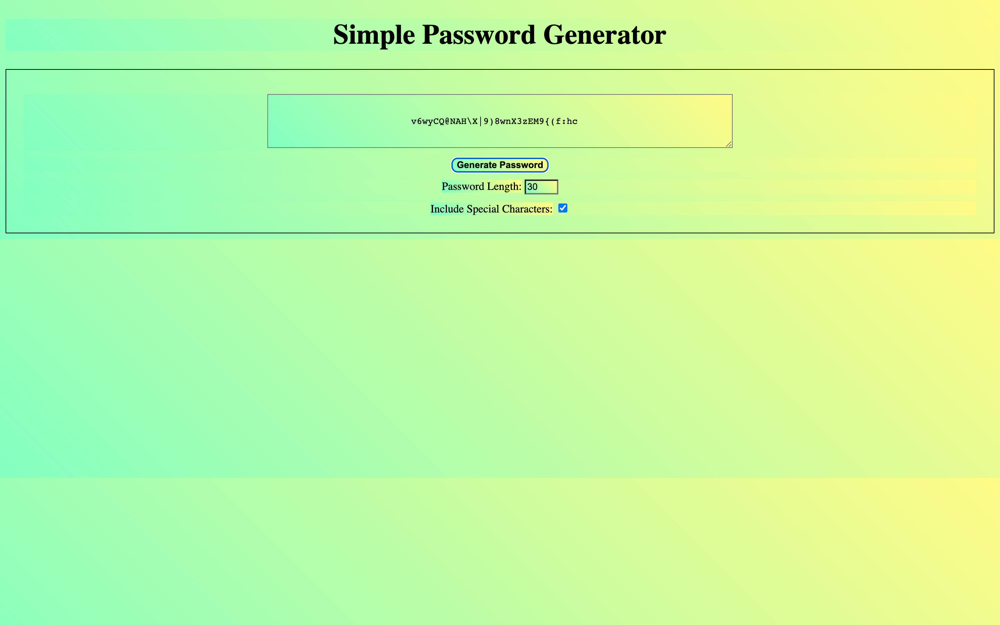

    
## Table of Contents
- [Description](#description)
- [Usage](#usage)
- [Installation](#installation)
- [Contributors](#contributors)
- [Questions](#question)
- [License](#license)
    
        
# Description
Created a simple javascript password generator that on button click, generates a password based on the given criteria, generates the password in the text box for you to use for needs. 
    
# Usage
To help start me off on my javascript journey and help me with something that comes in handy in my daily life
    
# Installation
No installation necessary. Just have the files I have on Github.
    
# Contributors
No
    
# Contact Me

github: tyguymills
Email: tyguymills@gmail.com
    

